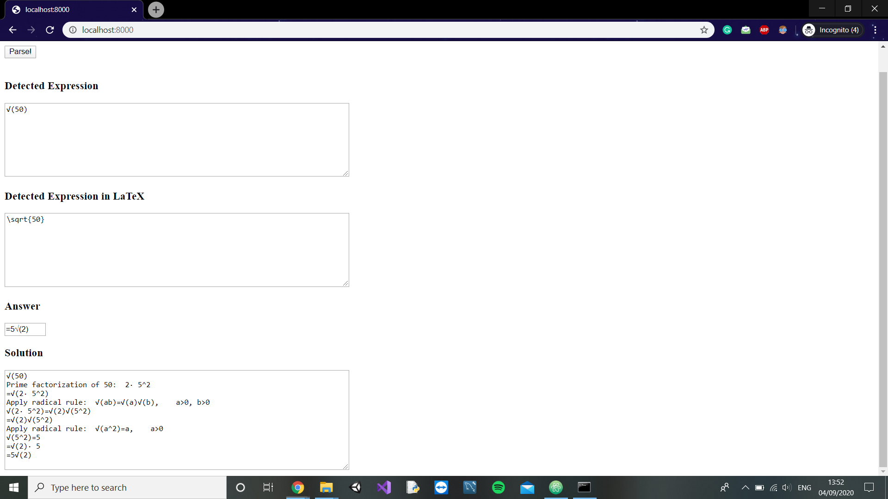

# Solve it in a go
A Django web app which takes in an image of a math expression and returns you the answer as well as the solution for the same. It also returns the latex equivalent of the expression/equation in the input image. The tool is built with a primary objective to help educationally disadvantaged parents evaluate their children's math homeworks.

## setup
Run `pip install -r requirements.txt` to install all the dependencies. Please ensure you have CUDA installed to run the program. Predictions made using CPU are observed to be erraneous.

## How to run the web-app?
`cd Solve-it-in-a-go/`
`python3 manage.py runserver`

## demo results obtained

## references
The code for the underlying Deep Learning model is adapted from the implementation of Hongyu Wang's [Pytorch Implemention](https://github.com/whywhs/Pytorch-Handwritten-Mathematical-Expression-Recognition) of the same.
